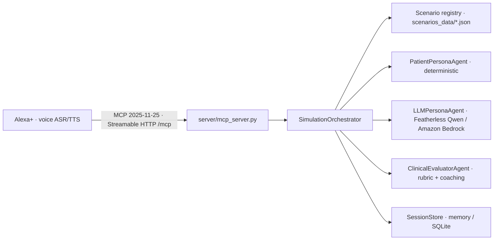

# Clinical Conversation Coach for Alexa+

This repository is a local-development starter for a **scenario-based clinical communication simulator** exposed through a self-hosted MCP server for Alexa+. It helps learners practice structured patient interviews and receive transparent, evidence-linked feedback.

> **Educational safety boundary:** This project is not a medical device, diagnostic system, triage service, or substitute for supervised clinical education. Use synthetic scenarios only. Do not use it with real patient data or for real-time clinical decision-making.

## Amazon AppDev 2026 positioning

The project is designed for the **Alexa+ primary track** of the Amazon AppDev 2026 hackathon. It includes a self-hosted MCP server using the official Python MCP SDK and Streamable HTTP transport, with task-oriented tools for discovering scenarios, starting sessions, conducting practitioner turns, and requesting evaluation.

The hackathon requires an Alexa+ working Agent Skill or self-hosted MCP server using MCP version 2025-11-25 or later over Streamable HTTP. The repository also includes a conventional FastAPI development API for local testing, but the MCP server is the track-facing integration surface.

See [`HACKATHON_STRATEGY.md`](HACKATHON_STRATEGY.md) for the submission strategy, judging alignment, and the three-minute demo plan, and [`SUBMISSION.md`](SUBMISSION.md) for the ready-to-paste Devpost form fields.

## Architecture

| Layer                | Responsibility                                           | Implementation                                 |
| -------------------- | -------------------------------------------------------- | ---------------------------------------------- |
| Alexa+/MCP transport | Expose agent-callable operations over Streamable HTTP    | `server/mcp_server.py`, `/mcp` on port 8001    |
| Session              | Lifecycle, transcript, retries, and scenario consistency | `SimulationOrchestrator`                       |
| Scenario             | Facts, disclosure rules, safety terms, and rubric        | `server/scenarios.py`                          |
| Patient policy       | Stateful, scenario-constrained responses                 | `PatientPersonaAgent`                          |
| Evaluation policy    | Versioned scoring with transcript evidence               | `ClinicalEvaluatorAgent`                       |



The MCP server is **text-in/text-out**. Voice is supplied by the Alexa+ agent, which provides automatic speech recognition (ASR) and text-to-speech (TTS) natively; this project does not reimplement a speech stack. The "voice-first" framing refers to the Alexa+ surface, not to embedded TTS/ASR here.

## Quick start

```bash
chmod +x scripts/*.sh
./scripts/initialize.sh
source .venv/bin/activate
```

Start the Alexa+ MCP server:

```bash
./scripts/start_mcp_server.sh
```

The script applies localhost binding, the `/mcp` path, and local host/origin allowlists by default. You can override them with `MCP_HOST`, `MCP_PORT`, `MCP_PATH`, `MCP_ALLOWED_HOSTS`, and `MCP_ALLOWED_ORIGINS`.

The MCP endpoint is `http://127.0.0.1:8001/mcp`.

For a hosted development demo, put the MCP endpoint behind HTTPS and an authenticated reverse proxy. Do not expose the unauthenticated local server directly to the public internet.

## MCP tool surface

The MCP server exposes five agent-callable tools:

| Tool                        | Purpose                                                             |
| --------------------------- | ------------------------------------------------------------------- |
| `list_simulation_scenarios` | Lists scenario IDs, versions, titles, and rubric metric IDs         |
| `start_simulation`          | Starts a scenario and returns the patient opening response          |
| `send_practitioner_turn`    | Processes a learner utterance and returns the next patient response |
| `evaluate_simulation`       | Returns evidence-linked rubric feedback without ending the session  |
| `end_simulation`            | Returns the final evaluation and locks the session                  |

These tools are deliberately higher-level than internal REST routes. An Alexa+ agent can orchestrate a complete session without knowing the implementation details of transcript storage or scenario matching. Every session tool also accepts an optional `learner_id`; when supplied, the coach remembers that learner across sessions (see below).

See `TOOLS.md` for the generated parameter reference. When `MCP_EXPOSE_SESSION_TOOLS=true` is set, two additional gated tools (`list_sessions`, `delete_session`) are registered for agent-side session management, and when `MCP_EXPOSE_LEARNER_TOOLS=true` is set, `get_learner_progress` is registered. They are off by default because they reveal session/learner identifiers to any API-key holder.

## Scenario and evaluator model

`server/scenarios.py` is the scenario registry. Each `ScenarioDefinition` contains a stable scenario ID, version, opening statement, disclosure rules, safety terms, and rubric metrics. Scenarios are authored as JSON in `server/scenarios_data/`; see `SCENARIOS.md` for the schema and grading rules.

`PatientPersonaAgent` applies disclosure rules to the active scenario and tracks disclosed facts and emotional state. An optional LLM-backed adapter (`LLMPersonaAgent`) can generate more natural patient responses using any OpenAI-compatible chat completions API **or Amazon Bedrock's Converse API**. The scenario registry — not the model — remains the authority over which facts may be disclosed. The LLM adapter enforces scenario constraints and falls back to the deterministic agent when the LLM is unavailable or returns invalid output.

To enable the LLM adapter over an OpenAI-compatible endpoint (Featherless example, any compatible API works):

```bash
INFERENCE_PROVIDER=llm
INFERENCE_BASE_URL=https://api.featherless.ai/v1
INFERENCE_API_KEY=your-featherless-key
INFERENCE_MODEL=Qwen/Qwen2.5-14B-Instruct
INFERENCE_TIMEOUT=15
```

To use **Amazon Bedrock** instead (AWS Builder mini-challenge), install the extra and point `INFERENCE_PROVIDER` at Bedrock:

```bash
pip install -e ".[bedrock]"
export AWS_ACCESS_KEY_ID=...   # or rely on an instance role
export AWS_SECRET_ACCESS_KEY=...
INFERENCE_PROVIDER=bedrock
BEDROCK_MODEL_ID=qwen/qwen3-30b-a3b-instruct   # verify with: aws bedrock list-foundation-models
AWS_REGION=us-east-1
```

The Bedrock path uses the Converse API (`bedrock-runtime`) with an explicit `maxTokens` and adaptive retry; `boto3` is an optional dependency so the core install stays lean.

`ClinicalEvaluatorAgent` produces `MetricScore` objects containing a metric ID, score, maximum score, matched terms, transcript evidence, and rationale. The final evaluation includes the rubric version, overall score, strengths, improvements, concrete coaching suggestions, and an educational disclaimer.

## Session persistence

Sessions live in memory by default. Set `SESSION_DB_PATH` to a file path to back them with SQLite (WAL mode), so state survives a process restart inside the same container:

```bash
SESSION_DB_PATH=/data/sessions.db
```

The store survives worker and process restarts. App Runner redeploys replace the container filesystem, so to survive those, point `SESSION_DB_PATH` at a mounted EFS volume (via a VPC connector). `server/storage.py` is the seam to swap for a DynamoDB-backed store if you scale past a single instance.

## Cross-session learner progress

Pass an optional `learner_id` on `start_simulation` (or any other session tool) and the coach becomes context-aware across sessions. Each completed `end_simulation` folds the session's rubric into a learner record that tracks, per metric:

- best and latest score, plus attempt count;
- which metrics improved this session; and
- a recommended next focus (the weakest metric by mastery).

The `end_simulation` response then carries a `learner_progress` object with a spoken-friendly `adaptive_note` (e.g. "Session 3 complete. Improved: Safety escalation. Focus next: Shared next-step confirmation."), so an Alexa+ agent can greet a returning learner and steer their next practice session. A gated `get_learner_progress` tool exposes the same record on demand when `MCP_EXPOSE_LEARNER_TOOLS=true`.

Learner records persist to the same SQLite store as sessions (`SESSION_DB_PATH`) via `LearnerStore`, so progress survives restarts. A learner ID is an opaque string the application chooses; it is never derived from or tied to a real identity inside this server.

## Security boundaries

The MCP transport runs on `127.0.0.1` by default, following the Streamable HTTP guidance to bind local servers to localhost. The MCP endpoint supports an optional `MCP_API_KEY` (accepted as `Authorization: Bearer <key>` or `X-API-Key: <key>`) and per-client rate limiting via `MCP_RATE_LIMIT_REQUESTS` and `MCP_RATE_LIMIT_WINDOW_SECONDS` (both default to disabled locally). For a public demo, set `MCP_API_KEY`, enable rate limiting, add HTTPS and strict origin validation, and put the endpoint behind an authenticated reverse proxy.

Session IDs cannot switch scenarios, ended sessions reject further messages, and client event IDs prevent duplicate processing after retries.

## Testing

```bash
source .venv/bin/activate
pytest -q
python -m compileall -q server tests
```

The tests cover scenario versioning, patient disclosures, the graded rubric and coaching suggestions, idempotent retries, session locking, multi-topic disclosure matching, the MCP tool workflow (start → send → evaluate → end), all seven scenarios, cross-session learner progress (recording, improvement detection, and adaptive focus), the Bedrock request builder, and MCP API-key auth and rate limiting. The MCP server entrypoint is smoke-tested via the Streamable HTTP test app.

## Lint

```bash
source .venv/bin/activate
ruff check server tests
ruff format --check server tests
```

## Docker

```bash
docker build -t clinical-sim .
docker run -p 8001:8001 clinical-sim
```

The MCP endpoint is available at `http://localhost:8001/mcp`.

## AWS App Runner deployment

For the AWS Builder mini-challenge, the project uses **Amazon Bedrock** (optional LLM persona), **Amazon ECR** (image registry), and **AWS App Runner** (hosting). Deployment is configured in `apprunner.yaml` and `scripts/deploy_aws.sh`.

```bash
# Prerequisites: AWS CLI configured, Docker installed
./scripts/deploy_aws.sh
```

The script builds the Docker image, pushes it to ECR, and creates or updates an App Runner service with HTTPS, auto-scaling, and a public MCP endpoint at `https://<random>.awsapprunner.com/mcp`.

## CI/CD

`.github/workflows/ci.yml` runs `ruff check` and `pytest` on every push to `master` and every pull request.

`.github/workflows/deploy.yml` gates on the same tests, then builds and redeploys to App Runner on a `v*` tag (or manual dispatch). It authenticates with GitHub OIDC into AWS:

1. Create an IAM role whose trust policy allows the GitHub repo (via an OIDC identity provider), and attach permissions for ECR push plus App Runner create/update.
2. Store the role ARN in the `AWS_DEPLOY_ROLE_ARN` repository secret.
3. Add `MCP_API_KEY`, `INFERENCE_BASE_URL`, and `INFERENCE_API_KEY` as repository secrets.

The deploy workflow runs the same `scripts/deploy_aws.sh` used for manual deploys, tagged with the commit SHA.

## Hackathon submission requirements

The Alexa+ submission includes a public GitHub repository with this source, assets, setup instructions, and `LICENSE`; a public demo video under three minutes showing the MCP tools and end-to-end simulation; a concise project description; product feedback for the MCP/Alexa+ developer experience; and a friction log with concrete setup or integration issues.

The AWS Builder mini-challenge is claimed via Amazon Bedrock (optional LLM persona), Amazon ECR, and AWS App Runner; the Open Source mini-challenge is claimed via this new public, MIT-licensed repository. See [`SUBMISSION.md`](SUBMISSION.md) for the ready-to-paste Devpost fields and [`PRODUCT_FEEDBACK.md`](PRODUCT_FEEDBACK.md) for the feedback and friction log.

## Layout

```text
alexa-clinical-sim/
├── Dockerfile
├── LICENSE
├── README.md
├── HACKATHON_STRATEGY.md
├── PRODUCT_FEEDBACK.md
├── SUBMISSION.md
├── DEMO_TRANSCRIPT.md
├── ALEXA_PLUS_3_MINUTE_PITCH.md
├── ALEXA_PLUS_MCP_PYTHON_RUNBOOK.md
├── UPGRADE_PLAN.md
├── SCENARIOS.md
├── TOOLS.md
├── apprunner.yaml
├── package.json
├── pyproject.toml
├── uv.lock
├── pytest.ini
├── demo-video/                    # Remotion renderer + ElevenLabs narration (gitignored output)
├── .github/
│   └── workflows/
│       ├── ci.yml
│       └── deploy.yml
├── server/
│   ├── requirements.txt
│   ├── requirements-dev.txt
│   ├── main.py
│   ├── mcp_server.py
│   ├── observability.py
│   ├── storage.py
│   ├── scenarios.py
│   ├── scenarios_data/
│   ├── _version.py
│   ├── agents/
│   │   ├── patient_persona.py
│   │   ├── llm_persona.py
│   │   └── clinical_evaluator.py
│   └── schemas/
├── scripts/
│   ├── initialize.sh
│   ├── start_mcp_server.sh
│   ├── deploy_aws.sh
│   └── gen_tool_reference.py
└── tests/
    ├── test_simulation.py
    ├── test_mcp_protocol.py
    ├── test_mcp_security.py
    ├── test_llm_persona.py
    ├── test_llm_persona_bedrock.py
    ├── test_evaluator.py
    ├── test_session_lifecycle.py
    ├── test_observability.py
    ├── test_persistence.py
    └── test_session_tools.py
```
